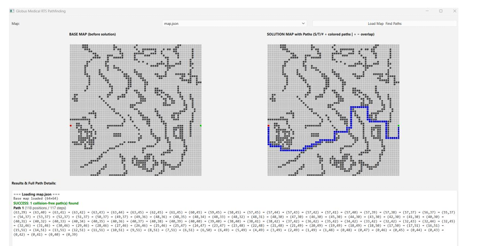
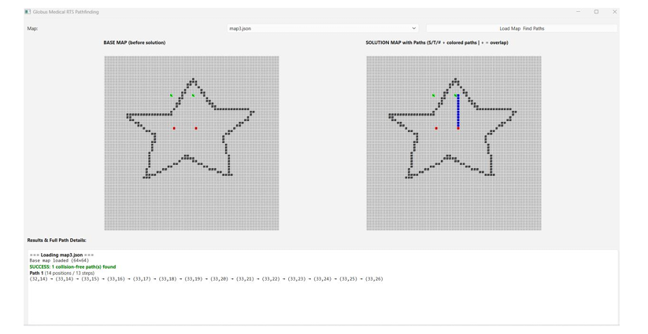

# RTS_Pathfinding

A C++20 application using **Qt Widgets** that loads 64×64 tile-based maps from JSON, computes collision-free shortest paths for multiple agents (each starting position must reach a unique target), and visualizes the map, computed paths, and execution log.

The solution prevents agents from occupying the same tile at the same time and guarantees shortest possible paths under these constraints.

## Features

- Load and validate 64×64 tile maps from JSON files
- Visualize input map with Free, Start, Target, and Elevated tiles
- Compute collision-free, shortest paths for all agents using time-aware multi-source BFS
- Greedy assignment of paths to ensure valid one-to-one start–target matching
- Interactive Qt-based UI: map selection, execution trigger, grid visualization, and detailed textual log
- Modular architecture separating concerns (UI, domain, logic, pathfinding)

## Tech Stack

- **Language**: C++20
- **Framework**: Qt Widgets (Qt 6 recommended)
- **Other**: Standard Library, JSON parsing (e.g. nlohmann/json or Qt JSON)

## Architecture

The project follows a clean, layered architecture:

- **Entry Point**  
  `main.cpp` — Initializes `QApplication` and shows the main window.

- **UI Layer**  
  `mainwindow.h` / `mainwindow.cpp` / `mainwindow.ui`  
  Handles file selection, triggers computation, renders input & solution grids (colored tiles + path overlays), and displays logs.

- **Domain Model**  
  `battlematrix.h` / `battlematrix.cpp`  
  Immutable representation of the grid using an `enum class Tile { Free, Start, Target, Elevated }`.  
  Provides utilities for indexing, position queries, neighbor enumeration, etc.

- **Application Logic / Orchestration**  
  `model.h` / `model.cpp`  
  Loads and validates JSON maps, extracts start/target positions, coordinates pathfinding, and returns success/failure + selected paths.

- **Pathfinding Engine**  
  `shortestpath.h` / `shortestpath.cpp`  
  Implements **multi-source BFS with time-layer occupancy tracking** to avoid same-tile-same-time collisions.  
  Generates candidate shortest paths per agent, then applies a greedy assignment step to produce a valid, collision-free solution with minimal total cost.

### Data Flow
UI → select & load JSON map
→ build BattleMatrix
→ compute paths via Model
→ return results (success + paths)
→ render grids + log in U

